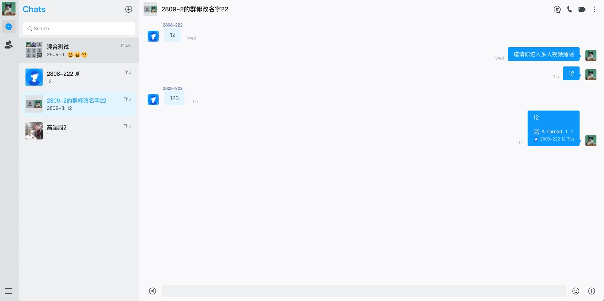

## 产品介绍

环信 IM 产品展示了怎么使用环信 `easemob-chat-uikit` 创建一个完整的聊天 APP。展示的功能包括：用户登录注册，添加好友，单聊，群聊，发送文字，表情，语音，图片，文件等消息，以及实时音视频通话等。

其中音视频通话使用声网 `chat-callkit` 实现。

## 产品体验



[项目线上地址](https://uikit-demo.oss-cn-beijing.aliyuncs.com/login)

## 前置依赖

1. [注册环信应用](https://doc.easemob.com/product/enable_and_configure_IM.html)

2. 示例项目中登录，上传头像，获取群组头像，音视频功能依赖的 app server 来实现，所以你需要参考 app server 示例代码来实现自己的 app server，需要确保 app server 中使用的 appKey 和本项目中配置的是相同的。
   // TODO 链接

## 跑通项目

1. 配置项目

创建 .env.config.ts 文件放入 src 目录下，配置自己的 AppKey, AppId, AppServer

```typescript
export AppKey = 'you AppKey';
export AppId = 'your AppId'
export AppServer = 'https://example.com/'
```

2. 安装依赖

```
npm install
```

3. 启动项目

```
npm start
```

## 项目结构

```
uikit-demo-easemob
├── build
|  └── static
|     ├── css
|     ├── js
|     └── media
├── config
|  ├── jest
|  └── webpack
|     └── persistentCache
├── public
├── scripts
└── src // 源码
   ├── UIKit // UIKit 中的事件监听
   ├── assets // 资源文件
   ├── components
   |  ├── imageCrop // 图片裁剪组件
   |  ├── navigationBar // 导航组件
   |  ├── toast // 提示组件
   |  ├── userInfo // 用户个人信息组件
   |  └── userInviteModal // 多人音视频邀请人组件
   ├── hooks
   ├── i18n // 国际化文案
   |  └── lang
   ├── pages
   |  ├── chatContainer // 聊天页面
   |  ├── contacts // 通讯录页面
   |  ├── login // 登录页面
   |  ├── main // 应用布局
   |  └── settings // 设置页面
   |     └── about // 关于
   |     ├── general // 通用
   |     ├── notification // 消息通知
   |     ├── personalInfo // 个人信息
   |     └── settingTab // tab 切换组件
   ├── routes // 路由
   ├── service // 应用所需要的服务
   ├── store // 全局 state
   └── utils // 工具方法
```

## Q&A

如有问题请联系环信技术支持或者提 issues
