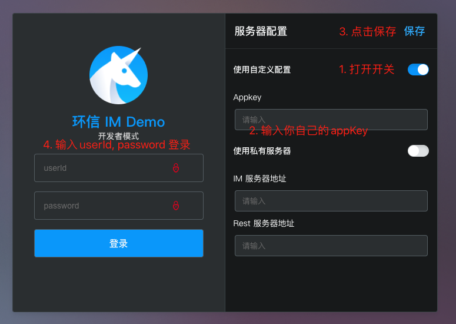

## 产品介绍

环信新版本 UIKit Demo：打造卓越聊天体验的强大工具

全面功能，产品化体验

环信 UIKit Demo 为您提供全面的聊天功能，助力您轻松构建功能强大、产品化的聊天体验。从基本的文字消息到高级的群组互动，我们的 Demo 涵盖了所有市场通用能力，让您能够满足用户的各种聊天需求。

开箱即用，快速集成

我们的 Demo 经过精心设计，可轻松集成到您的现有应用程序中。清晰的代码结构和详尽的文档让您能够快速上手，无需繁琐的配置和开发工作。

应用服务器示例代码，简化集成

为了进一步简化集成过程，我们提供了完整的应用服务器示例代码，展示了如何使用环信 `easemob-chat-uikit` 创建一个完整的聊天 APP。展示的功能包括：用户登录注册，添加好友，单聊，群聊，发送文字，表情，语音，图片，文件等消息，以及实时音视频通话等。这将帮助您轻松实现聊天功能的部署和运行。

功能亮点:

流畅的实时消息传递 语音和视频通话 文件共享 群组聊天 线程讨论 群组成员管理 消息提醒 可定制界面 预配置的聊天功能 应用服务器示例代码

立即体验环信新版本 UIKit Demo，开始构建您的梦想聊天应用程序吧！

## 产品体验


[项目线上地址](https://webim-h5.easemob.com/login)

## 前置依赖

1. [注册环信应用](https://doc.easemob.com/product/enable_and_configure_IM.html)

2. 示例项目中登录，上传头像，获取群组头像，音视频功能依赖的 app server 来实现，所以你需要参考 app server [示例代码](https://github.com/easemob/easemob-demo-appserver/tree/dev-demo)来实现自己的 app server，需要确保 app server 中使用的 appKey 和本项目中配置的是相同的。

## 跑通项目

示例项目中依赖了 appServer 来实现部分功能，所以要体验全部功能需要先实现 appServer，为了方便运行起来，项目支持使用开发者模式运行。

### 开发者模式运行

1. 安装依赖

```
npm install
```

2. 启动项目

```
npm start
```

3. 配置 appKey
   在浏览器打开：http://localhost:3000/dev 按照如下配置好 appKey，在这个页面可以使用 userId, password 进行登录。
   

### 正式模式运行

1. 首先需要实现 appServer, 然后将 src/service 里面用到的服务替换成你自己的服务，然后把 src/config 里面的 appKey 和 appId 替换成和 appServer 里一样的。

2. 安装依赖

```
npm install
```

3. 启动项目

```
npm start
```

## 项目结构

```
uikit-demo-easemob
├── build
|  └── static
|     ├── css
|     ├── js
|     └── media
├── config
|  ├── jest
|  └── webpack
|     └── persistentCache
├── public
├── scripts
└── src // 源码
   ├── UIKit // UIKit 中的事件监听
   ├── assets // 资源文件
   ├── components
   |  ├── imageCrop // 图片裁剪组件
   |  ├── navigationBar // 导航组件
   |  ├── toast // 提示组件
   |  ├── userInfo // 用户个人信息组件
   |  └── userInviteModal // 多人音视频邀请人组件
   ├── hooks
   ├── i18n // 国际化文案
   |  └── lang
   ├── pages
   |  ├── chatContainer // 聊天页面
   |  ├── contacts // 通讯录页面
   |  ├── login // 登录页面
   |  ├── main // 应用布局
   |  └── settings // 设置页面
   |     └── about // 关于
   |     ├── general // 通用
   |     ├── notification // 消息通知
   |     ├── personalInfo // 个人信息
   |     └── settingTab // tab 切换组件
   ├── routes // 路由
   ├── service // 应用所需要的服务
   ├── store // 全局 state
   └── utils // 工具方法
```

## Q&A

如有问题请联系环信技术支持或者提 issues
